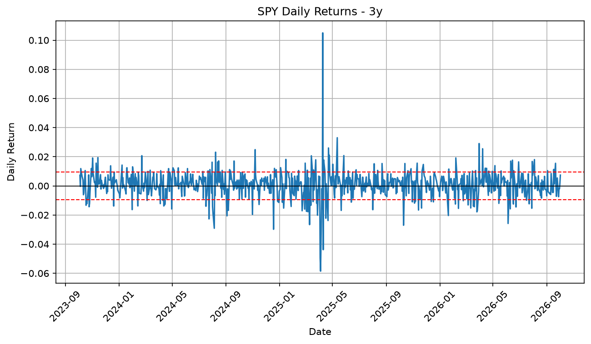

# Stock Risk Report

A Python tool that pulls live market data for any ticker and produces a complete risk report — performance metrics, a returns chart with volatility bands, and a formatted Excel workbook.

Change one line at the top of the script and the entire report regenerates for a different stock.

## Why I Built It

Measuring the risk of a position usually means pulling prices into a spreadsheet, writing the same formulas again, and rebuilding a chart from scratch. This script does all of it in one run and produces an output someone else can open without touching Python.

It also separates two things that are easy to confuse: how much a stock *returned* and how much it *moved* on the way there. A position can finish the year flat after swinging 10% in a single day, and only one of those facts shows up in a total return figure.

## What It Does

- Pulls historical price data from Yahoo Finance for any ticker
- Cleans incomplete rows, including the partial row returned during market hours
- Calculates daily returns and a full set of risk and performance metrics
- Plots daily returns with a zero line and ±1 standard deviation bands
- Writes an Excel workbook with the raw data, a summary table, and the chart embedded as its own sheet

## Metrics Calculated

| Metric | What it measures |
|---|---|
| Annualized volatility | Daily standard deviation scaled by √252 trading days |
| Average daily return | Mean of daily percentage changes |
| Total return | Percentage change from first close to last close |
| Best day | Largest single-day gain over the period |
| Worst day | Largest single-day loss over the period |
| Up days | Count of days closing higher than the previous close |
| Up day percentage | Up days as a share of all trading days |

## Reading the Chart

The dashed red lines mark one standard deviation above and below zero. Roughly two-thirds of trading days should fall inside that band. The days that break through are the ones worth investigating — earnings, macro releases, or shocks.



## Output

Running the script produces two files, both named after the ticker:

- `TICKER_returns.png` — the returns chart
- `TICKER_report.xlsx` — a workbook containing:
  - **Data** — full price history with the daily return column
  - **Summary** — all calculated metrics
  - **Chart** — the returns chart embedded in the sheet

## How to Run

Install the dependencies:

```
pip install pandas numpy yfinance matplotlib openpyxl pillow
```

Change the settings at the top of the script:

```python
TICKER = "SPY"
PERIOD = "3y"
FOLDER = "your/output/path/"
```

`PERIOD` accepts any yfinance range — `1mo`, `6mo`, `1y`, `2y`, `5y`, `max`.

Then run it.

## Built With

**pandas** · data handling and the summary table
**numpy** · annualization math
**yfinance** · market data
**matplotlib** · charting
**openpyxl** · Excel output and image embedding

## Notes

Volatility is annualized using 252 trading days, the standard convention for U.S. equities. Returns are simple percentage changes rather than log returns.
